# Aurora RDS 스케일 업

- Auror RDS를 스케일 업을 해보자
- 기본적으로 Aurora RDS는 Cluster / Instance 로 나뉜다
- Cluster의 Writer / Read 엔드포인트가 있고, Instance 자체의 Endpoint도 존재한다.
- 그래서 왠만하면 Cluster Endpoint를 사용하자 -> 인스턴스 Endpoint는 바뀔수 있다

## Cluster Level의 Endpoint

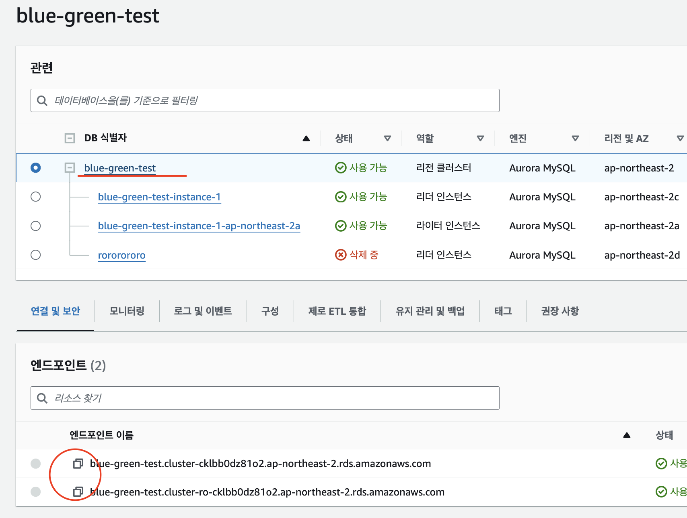

## Instance Level의 Endpoint

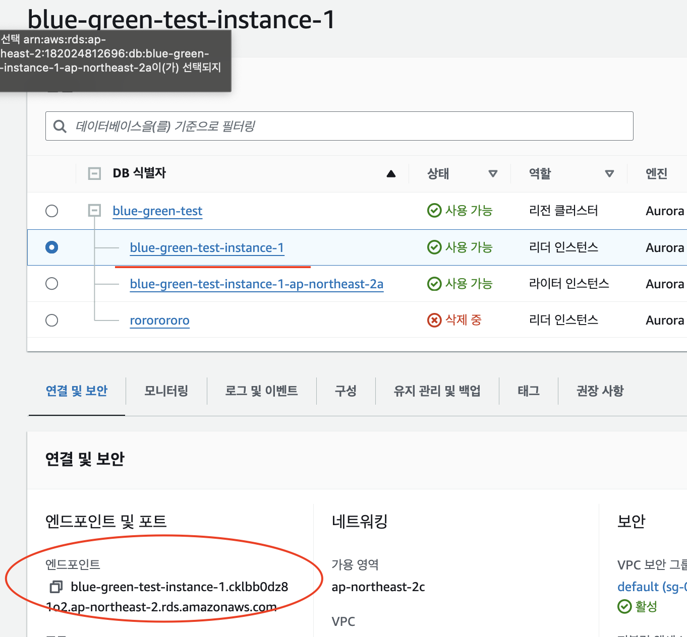

## 1. 인스턴스 자체를 그냥 Scale-up (비추)

- Writer 인스턴스를 Scale-up을 하기위해 수정을 진행
- 순단 5~10분정도 발생 

## 2. New Instance를 하나 띄워서 Fail over (나름 괜찮)

- 기존 Read / Write 인스턴스 2개가 있다는 가정
- New Reader Instance를 생성 (스펙업 된 상태)
- Fail over를 진행하여서 스펙업된 Reader Instnace와 Writer Instnace를 교체
- 순단이 10~15초 정도 발생
- 만약, 서비스가 Retry 옵션이 없다면 ? -> 서비스가 죽을듯 ...

## 3. BlueGreen 배포 (1시간 30분정도 걸림...)

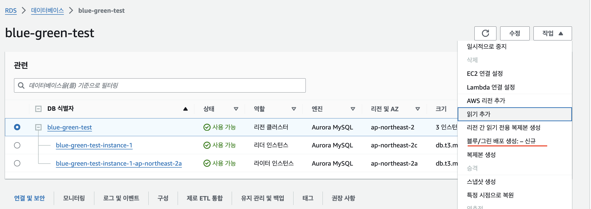

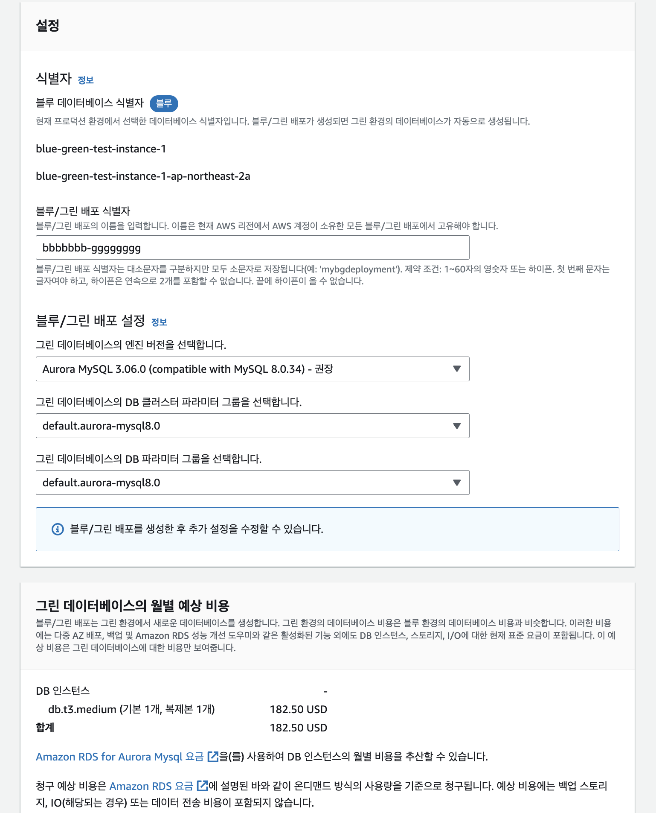

- 클러스터 + 인스턴스와 동일한 환경을 만드는듯...

```
Blue/Green Deployments require a DB cluster with logical replication enabled. Before you create a Blue/Green Deployment for a DB cluster, associate the DB cluster with a custom DB cluster parameter group that enables logical replication.
```

- 이런 문제가 나는데...

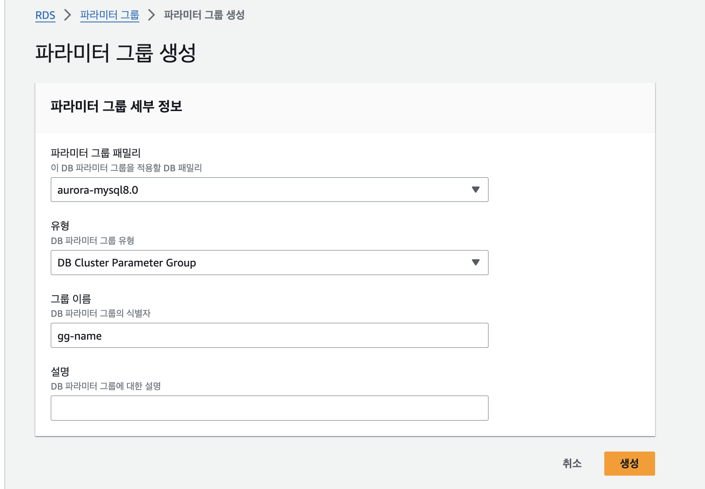
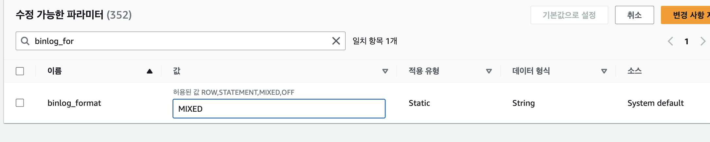

- 파라미터 클러스터 그룹을 생성하자 (없었다면, 생성 후 적용하자...)
- 파라미터 -> 인스턴스 순서대로 적용되려면 5분정도 걸림 (다운타임은 없음)
- binlog를 Mixed로 수정하자 (****)

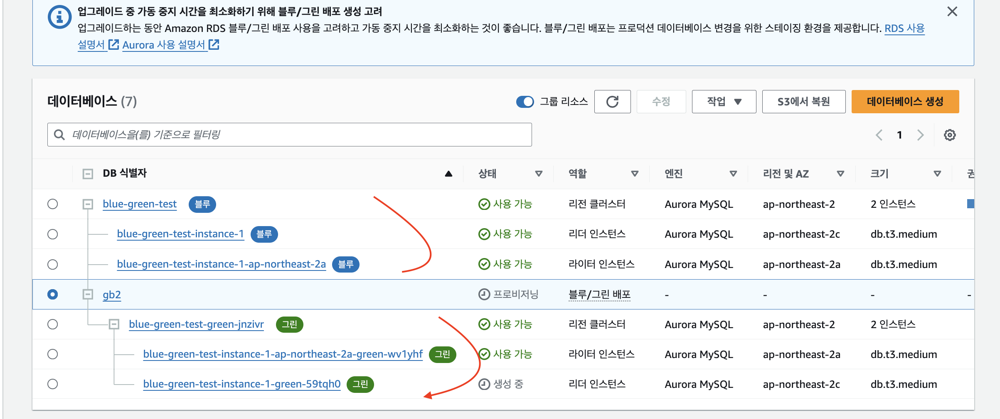

- 엄청 오래걸린다 (50분 정도...)

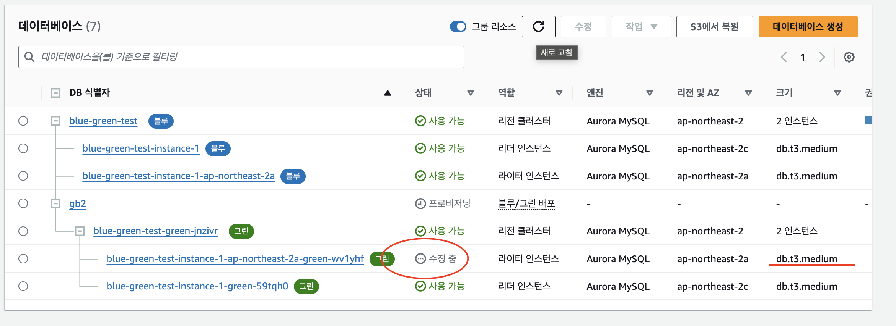

- 기존 Writer 인스턴스를 스펙업을 한다.

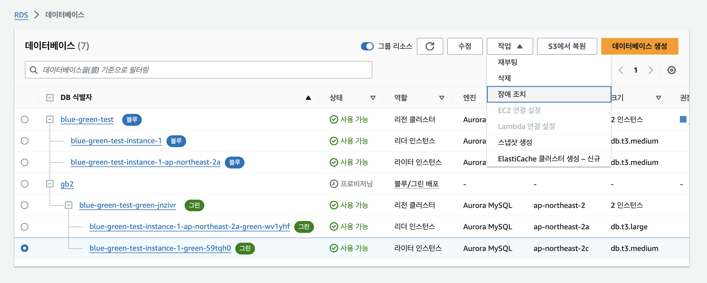
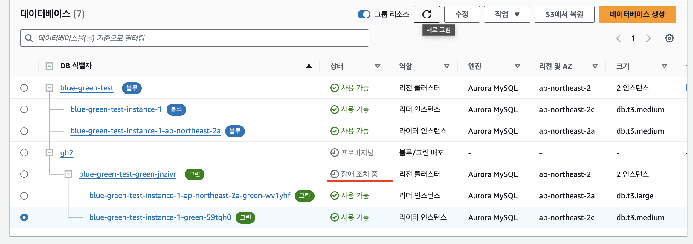
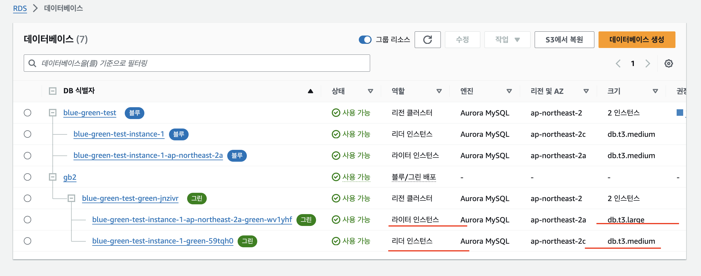

- 장애조치를 진행한다 (Reader / Writer 전환)

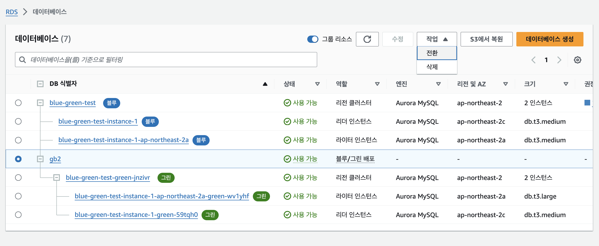

- Blue/Green 배포로 전환한다.
- 순단이 발생하긴 함.... (30s)

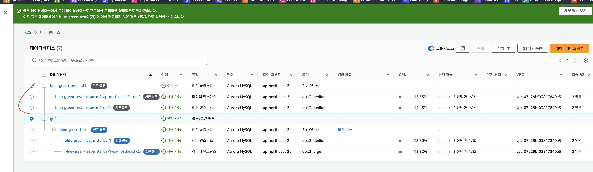

- 전환이 되었다면, 기존꺼 삭제...

## Write 계속 하는 함수 (js)

```js
import mysql from 'mysql'

const WRITE = "blue-green-test.cluster-cklbb0dz81o2.ap-northeast-2.rds.amazonaws.com"
const READ = "blue-green-test.cluster-ro-cklbb0dz81o2.ap-northeast-2.rds.amazonaws.com"

let i = 0

// MySQL 연결 설정
const connection = mysql.createConnection({
    host: WRITE, // MySQL 호스트
    user: "admin", // MySQL 사용자명
    password: "12341234", // MySQL 비밀번호
    database: 'users' // 사용할 데이터베이스
});

// MySQL 연결
connection.connect((err) => {
    if (err) {
        console.error('MySQL 연결 오류:', err);
        return;
    }
    console.log('MySQL에 성공적으로 연결되었습니다.');
});

// 데이터 삽입 함수
function insertData() {

    const data = ["hello"]
    // // INSERT 쿼리 실행
    connection.query('INSERT INTO userIds(name) VALUES ?', [[data]], (error, results, fields) => {
        if (error) {
            console.error('데이터 삽입 오류:', error);
            return;
        }
        console.log('데이터가 성공적으로 삽입되었습니다.', i++);
    });

    connection.query('INSERT INTO userFriends(friends) VALUES ?', [[data]], (error, results, fields) => {
        if (error) {
            console.error('데이터 삽입 오류:', error);
            return;
        }
        console.log('데이터가 성공적으로 삽입되었습니다.', i++);
    });
}

// 일정 간격으로 데이터 삽입 실행 (예: 1초마다)
setInterval(insertData, 100);

// 프로세스 종료 시 MySQL 연결 해제
process.on('SIGINT', () => {
    console.log('MySQL 연결을 종료합니다.');
    connection.end();
    process.exit();
});
```

## Read 계속 하는 함수  (js)

```js
import mysql from 'mysql'

const WRITE = "blue-green-test.cluster-cklbb0dz81o2.ap-northeast-2.rds.amazonaws.com"
const READ = "blue-green-test.cluster-ro-cklbb0dz81o2.ap-northeast-2.rds.amazonaws.com"

// MySQL 연결 설정
const connection = mysql.createConnection({
    host: READ, // MySQL 호스트
    user: "admin", // MySQL 사용자명
    password: "12341234", // MySQL 비밀번호
    database: 'users' // 사용할 데이터베이스
});

// MySQL 연결
connection.connect((err) => {
    if (err) {
        console.error('MySQL 연결 오류:', err);
        return;
    }
    console.log('MySQL에 성공적으로 연결되었습니다.');
});

function readData() {
    // SELECT 쿼리 실행
    connection.query('SELECT COUNT(*) AS count FROM userIds', (error, results, fields) => {
        if (error) {
            console.error('데이터 읽기 오류:', error);
            return;
        }
        console.log('데이터 읽기 결과:', results[0].count);
    });
}

// 일정 간격으로 데이터 삽입 실행 (예: 1초마다)
setInterval(readData, 1000);

// 프로세스 종료 시 MySQL 연결 해제
process.on('SIGINT', () => {
    console.log('MySQL 연결을 종료합니다.');
    connection.end();
    process.exit();
});
```


## 결론

- 인스턴스 Level의 Endpoint는 쓰지말자
- RDS Proxy를 사용하는것도 좋은 방법일것 같다
    - 람다처럼 많은 커넥션이 필요한 경우, 커넥션을 모아두었다가 폴링해두고 DB 부하를 경감시키는거 외 네트워크 목적으로도 사용